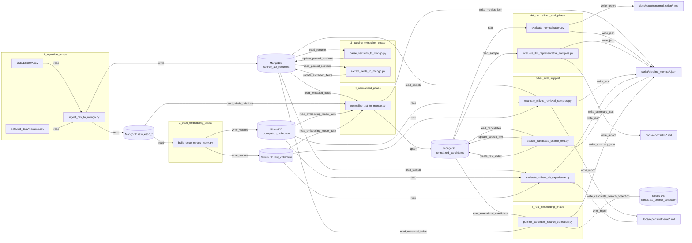

# Pipeline

## Scope
- This file is the canonical pipeline memo for `script/pipeline_mongo`.
- Covers implementation history from Issue #6 onward and current default behavior.

## Issue Timeline (Issue #6 -> current)
1. Issue #6: Mongo ingestion baseline
- Loaded ESCO raw CSV and 1st dataset into MongoDB.
- Established source collections and idempotent source key (`source_dataset + source_record_id`).
- Main script: `script/pipeline_mongo/ingest_csv_to_mongo.py`.

2. Issue #7: Section parsing layer
- Added parsed section storage and parser reports for source resumes.
- Prepared downstream deterministic extraction.
- Main script: `script/pipeline_mongo/parse_sections_to_mongo.py`.

3. Issue #8: Parser quality and structure refinement
- Improved section parsing stability and reporting.
- Reduced malformed section carry-over into extraction stage.

4. Issue #9: Deterministic field extraction
- Added rule-based extraction for experience/education/skills.
- Stored `extracted_fields` in source docs.
- Main scripts:
  - `script/pipeline_mongo/extract_fields.py`
  - `script/pipeline_mongo/extract_fields_to_mongo.py`

5. Issue #10: Simple but effective normalization pipeline
- Implemented occupation/skill matching using:
  - exact label
  - alt label
  - fuzzy fallback
- Added graph rerank by ESCO occupation-skill relations.
- Added guardrail for fuzzy misfire suppression.
- Added `llm_handoff` trigger fields for controlled downstream LLM usage.
- Main script: `script/pipeline_mongo/normalize_1st_to_mongo.py`.
- Full-run reference result (all 2484):
  - `success`: 2027
  - `partial`: 427
  - `failed`: 30
  - graph rank changed: 590

6. Issue #11 readiness (LLM gating)
- Confirmed trigger-gated strategy:
  - rerank trigger: 26 docs (1.05%)
  - extraction trigger: 781 docs (31.44%)
- Keep rule output as fallback if LLM fails.
- Note: `llm_handoff.rerank_trigger` is retained as ambiguity-monitoring metadata, not as an active LLM rerank execution path in current defaults.

7. Issue #12 readiness (data integrity)
- Confirmed idempotent upsert strategy is valid:
  - duplicate upsert key count: 0
  - missing `candidate_id`: 0
- Keep indexes for operational filtering (`normalization_status`, `llm_handoff.*`).

8. Issue #13 review
- No major plan rewrite required.
- Keep ranking metrics; add segmentation and integrity blocks in evaluation outputs.

9. Embedding + Milvus baseline
- Added hybrid embedding retrieval to normalization:
  - enabled for both occupation and skill candidates
  - merges embedding candidates with existing lexical candidates before profile filtering
  - safe fallback: if config/deps are missing, embedding auto-disables and lexical pipeline continues
- Added ESCO embedding index builder for Milvus cloud:
  - `script/pipeline_mongo/build_esco_milvus_index.py`
  - Occupation payload:
    - preferred + alt + description + hierarchy + essential skills
  - Skill payload:
    - preferred + alt + description + hierarchy + related occupations (essential)

10. Retrieval strategy refinement (2026-03-15)
- Occupation retrieval switched to `A + B1`:
  - A: base occupation semantic query
  - B1: base + raw experience query
  - final merge: RRF fusion before profile filtering
- Skill retrieval kept as `A` only:
  - experience-augmented query is not used in current default path
- Added embedding debug counters for:
  - occupation A candidates
  - occupation B1 candidates
  - fused occupation candidates
  - skill A candidates

11. Issue #13 implementation update (2026-03-16)
- Tried LLM-based occupation rerank after graph rerank.
- Result: improvement was limited relative to latency/cost and operational complexity.
- Decision: rollback LLM rerank path and remove it from defaults and docs.
- Kept record-level parallel normalization workers:
  - `--record-workers` parallelizes source-document processing in `main`
  - when `record_workers > 1`, phrase cache is local per record (`shared_phrase_cache=false`) to avoid cross-thread races

12. Issue #14 update (2026-03-16): LLM candidate generation
- Moved LLM usage from rerank to candidate creation stage.
- LLM input is built from:
  - `source_1st_resumes.extracted_fields` derived phrases/experience summary
  - ESCO classification snippets (preferred/description/hierarchy/alt labels)
- LLM outputs:
  - occupation seed ESCO IDs + occupation terms
  - skill seed ESCO IDs + skill terms
- Seeds are merged into lexical/embedding candidate generation before profile filtering.
- Added `matching_debug.llm_candidate_generation` diagnostics.
- Updated normalizer version:
  - `issue14_llm_candidate_generation_v2`
- Output caps are fixed for retrieval use:
  - occupation top N = 20
  - skill top N = 50

13. PR-06 schema design note (2026-03-16)
- Designed a serving-only Milvus collection for candidate search:
  - `candidate_search_collection` (planned)
- Decision: do not add new canonical fields to `source_1st_resumes` or `normalized_candidates` for PR-06.
- Real embedding phase will derive publish-time scalar fields from `normalized_candidates`:
  - `industry_esco_id`
  - `occupation_esco_ids_json`
  - `skill_esco_ids_json`
  - `experience_months_total`
  - `highest_education_level_rank`
  - `current_location`
- Real embedding phase will store two dense vector fields in one Milvus row:
  - `skill_vector`
  - `occupation_vector`
- Explanation payloads, source spans, and full profile details remain in MongoDB and are fetched by `candidate_id` / `normalized_doc_id` after retrieval.
- Rationale:
  - keep MongoDB as source of truth
  - keep Milvus limited to vector search + metadata filtering
  - avoid duplicating large explanation/debug payloads into the serving index

14. PR-06 publish job implementation update (2026-03-16)
- Added candidate serving index publish script:
  - `script/pipeline_mongo/publish_candidate_search_collection.py`
- Script behavior (default):
  - builds `skill_vector` / `occupation_vector` from `normalized_candidates` + `source_1st_resumes`
  - derives scalar metadata fields for FR hard filters
  - publishes into single Milvus `candidate_search_collection` with `snapshot_version` coexistence
  - keeps `occupation_esco_ids_json` / `skill_esco_ids_json` as `[]` when empty and still publishes
- Operational decisions in script:
  - initial embedding model default: `text-embedding-3-small`
  - full publish only (no partial by `normalizer_version`)
  - all-or-nothing rollback for failed snapshot publish
  - index/search defaults follow Issue #14 decision (`HNSW`, `COSINE`, `M=32`, `efConstruction=200`, `ef=128`)

15. PR-06 publish job follow-up update (2026-03-17)
- Aligned scalar unknown/null handling with `docs/schema/real-embedding-mapping.md`:
  - `industry_esco_id`: use `null` when immediate parent is unavailable
  - `experience_months_total`: use `null` when all `duration_months` are missing
  - `highest_education_level_rank`: use `0` for unknown (instead of sentinel negative values)
- Tightened `skill_vector` experience snippet extraction:
  - only keeps skill-bearing description sentences (skill anchor term match or skill-context hint)
- Made experience ordering deterministic for vector text assembly:
  - explicit recency sort with priority: `is_current` -> `end_date` -> `start_date`
- Milvus schema compatibility note:
  - `industry_esco_id` and `experience_months_total` are treated as nullable in publish payload.
  - Existing collections created with non-nullable schema should be recreated (or use a new collection name) before re-publish.

16. PR-07 industry multi-level metadata update (2026-03-17, Issue #26)
- Added multi-value industry metadata in publish payload:
  - `industry_esco_ids_json` is derived from all occupation candidate `hierarchy_json` entries.
  - candidate order is primary-first, then rank order.
  - each candidate hierarchy keeps near parent -> far parent order, then merged with dedup.
  - only ISCO-group parent IDs are kept (occupation URIs are excluded).
  - when hierarchy is unavailable, value is `[]` (not `null`).
- Backward compatibility is preserved:
  - existing `industry_esco_id` remains and is populated with the first element of `industry_esco_ids_json` (or `null`).
- Hard filter policy update for FR-01-03 / FR-01-03-07:
  - industry filter should be evaluated as query industry candidates ∩ candidate `industry_esco_ids_json`.
  - legacy `industry_esco_id` can be used as fallback during migration.
- Schema migration note:
  - existing collections without `industry_esco_ids_json` should be recreated, or publish should target a new collection name (recommended: `candidate_search_collection_v3`).

17. FR-02 keyword serving prep update (2026-03-17)
- Added idempotent backfill/index script:
  - `script/pipeline_mongo/backfill_candidate_search_text.py`
- Script responsibilities:
  - build `normalized_candidates.search_text` from normalized occupation/skill labels, raw phrases, recency-ordered experience snippets, and education fragments
  - stamp `search_text_version`
  - create `$text` index on `search_text` in the same run (if not already present)
  - write JSON summary report
- Verified execution snapshot:
  - first run: scanned 2484, updated 2484, created `idx_search_text_text`
  - second run: scanned 2484, updated 0 (idempotent), index reused
- Retrieval impact:
  - FR-02 keyword path is blocked without this preparation (`text index required for $text query`)
  - after backfill + index creation, `/search` integrated pipeline can proceed

18. FR-02 retrieval execution update (2026-03-17)
- Updated backend retrieval orchestration to run vector search and keyword search in parallel:
  - target: `backend/app/services/retrieval_pipeline.py`
  - method: `ThreadPoolExecutor(max_workers=2)` inside `RetrievalPipelineService.run()`
- Error handling policy (initial implementation):
  - fail-fast (if either side raises, retrieval pipeline raises and stops)
  - no partial-result fallback in this stage
- Timeout policy (initial implementation):
  - no per-search timeout added
  - follows existing API/runtime timeout behavior

19. FR-02 Mongo hard-filter field alignment update (2026-03-17)
- Updated Mongo-side hard filter field mapping in backend compiler:
  - skills: from `skill_esco_ids_json` -> `skill_candidates.esco_id`
  - occupations: from `occupation_esco_ids_json` -> `occupation_candidates.esco_id`
  - industries: from `industry_esco_ids_json` -> `occupation_candidates.hierarchy_json.id`
- Milvus-side hard filter mapping is unchanged:
  - still uses `json_contains_any(skill_esco_ids_json, ...)`, `json_contains_any(occupation_esco_ids_json, ...)`, and `json_contains_any(industry_esco_ids_json, ...)`
- Reason:
  - `normalized_candidates` stores skill/occupation ESCO IDs and occupation hierarchy IDs under nested candidate arrays for Mongo keyword serving path.
  - using flattened `*_esco_ids_json` in Mongo filter produced zero keyword candidates.

## Phase Definition (2026-03-16)
| Phase | Status | Purpose | Main Input | Main Output | Main Script(s) |
|---|---|---|---|---|---|
| 1. `ingestion phase` | implemented | CSVからMongoDBへ基礎データを投入する | ESCO CSV, `Resume.csv` | `source_1st_resumes`, `raw_esco_*` | `script/pipeline_mongo/ingest_csv_to_mongo.py` |
| 2. `esco embedding phase` | implemented | `raw_esco_*` をembeddingしてMilvusへ格納する | `raw_esco_*` | Milvus ESCO embedding collections | `script/pipeline_mongo/build_esco_milvus_index.py` |
| 3. `parsing_extraction phase` | implemented | `source_1st_resumes` のsection parsingとfield extractionを行う | `source_1st_resumes` | `source_1st_resumes.parsed_sections`, `source_1st_resumes.extracted_fields` | `script/pipeline_mongo/parse_sections_to_mongo.py`, `script/pipeline_mongo/extract_fields_to_mongo.py` |
| 4. `normalized phase` | implemented | `source_1st_resumes` と `raw_esco_*` と Milvus を照合して `normalized_candidates` を作る | `source_1st_resumes`, `raw_esco_*`, Milvus ESCO vectors | `normalized_candidates` | `script/pipeline_mongo/normalize_1st_to_mongo.py` |
| 4A. `normalized eval phase` | implemented | 正規化結果を評価する（現状: Weak評価 + LLM評価） | `normalized_candidates` | 評価Markdown/JSONレポート | `script/pipeline_mongo/evaluate_normalization.py`, `script/pipeline_mongo/evaluate_llm_representative_samples.py` |
| 5. `real embedding phase` | implemented | `normalized_candidates` から検索用 vector と filter 用 scalar を生成して Milvus へ publish する | `normalized_candidates`, `source_1st_resumes` | Milvus `candidate_search_collection` collection | `script/pipeline_mongo/publish_candidate_search_collection.py` |

## Additional Phase Proposals
- `retrieval eval phase` (implemented): embedding検索品質をAB/サンプルで検証する補助フェーズ。  
  scripts: `evaluate_milvus_retrieval_samples.py`, `evaluate_milvus_ab_experience.py`
- `quality gate phase` (proposed): 正規化実行後に最小品質基準（P@1, coverage, failed rate）を満たさない場合はpublishを止める運用フェーズ。
- `serving/index publish phase` (proposed): `normalized_candidates` から `candidate_search_collection` をスナップショット化して検索サービス向けに配布するフェーズ。

## Planned Phase 5 Collection Design
- Collection name:
  - `candidate_search_collection`
- One row represents:
  - one candidate in one published snapshot
- Vector fields:
  - `skill_vector`: skill semantic retrieval for `FR-01-04`
  - `occupation_vector`: occupation semantic retrieval for `FR-01-05`
- Required scalar filter fields:
  - `candidate_id`
  - `normalized_doc_id`
  - `source_dataset`
  - `source_record_id`
  - `snapshot_version`
  - `normalizer_version`
  - `embedding_model`
  - `embedding_version`
  - `category`
  - `industry_esco_id`
  - `industry_esco_ids_json`
  - `occupation_esco_ids_json`
  - `skill_esco_ids_json`
  - `experience_months_total`
  - `highest_education_level_rank`
  - `current_location`
- Field derivation rules:
  - `industry_esco_ids_json`: occupation candidates 全体の親チェーン ESCO component を primary優先 + rank順で統合（ISCO-group 親IDのみ、各候補は近い親 -> 遠い親、重複除去、取得不可時は `[]`）
  - `industry_esco_id`: backward compatibility 用。`industry_esco_ids_json` の先頭要素（直近親）を保持
  - `occupation_esco_ids_json`: `occupation_candidates` の ESCO ID を rank 順に保持（候補が無い場合は `[]`）
  - `skill_esco_ids_json`: `skill_candidates` の ESCO ID を rank 順に保持（候補が無い場合は `[]`）
  - `experience_months_total`: `experiences.duration_months` の合計
  - `highest_education_level_rank`: `educations.degree` / `field_of_study` から導出する ordinal
  - publish include rule:
    - `occupation_esco_ids_json` / `skill_esco_ids_json` が空でも候補者は publish 対象に含める
- Vector assembly rules:
  - `skill_vector`
    - top normalized skill labels
    - deduplicated raw skill phrases from `source_1st_resumes.extracted_fields.skills`
    - short recent experience context (`title` + skill-bearing snippets)
    - optional light occupation context
  - `occupation_vector`
    - primary/top normalized occupation labels
    - hierarchy labels of top occupation candidates
    - raw occupation phrases from `source_1st_resumes.extracted_fields.occupation_candidates`
    - recent experience titles / raw titles
    - optional current headline/title
  - Common rules
    - canonical normalized labels first, raw phrases second, context last
    - deduplicate near-identical phrases
    - exclude company names, locations, full resume dumps, `matching_debug`, `llm_handoff`
    - keep assembled text short and stable before embedding
- Education handling:
  - no dedicated `education_vector` in current design
  - education is treated as:
    - scalar filter via `highest_education_level_rank`
    - downstream scoring signal in search/rerank/explanation layers
  - if degree / field-of-study exact filtering becomes a hard requirement later,
    add a scalar metadata field first rather than a third vector field
- Explicit non-goals for Milvus:
  - full resume text
  - explanation payloads
  - `matching_debug`
  - `llm_handoff`
  - UI display-specific denormalized text
- Reference schema:
  - `docs/schema/dbdiagram.real_embedding.dbml`

## Current Default Behavior
- Normalizer script: `script/pipeline_mongo/normalize_1st_to_mongo.py`
- `--embedding-mode auto` is default.
- `--llm-candidate-mode always` is default.
- `--record-workers 1` is default (increase for throughput).
- When embedding is enabled:
  - Occupation: `A + B1` (RRF fusion)
  - Skill: `A` only
- Candidate generation path:
  - lexical phrases from extracted fields
  - optional embedding retrieval
  - LLM candidate generation (seed IDs + phrase expansion)
- Keyword retrieval prerequisite:
  - `normalized_candidates.search_text` must be backfilled
  - `$text` index on `search_text` must exist
- Final ranking path:
  - profile filter
  - graph rerank
  - category guardrail
- Output caps:
  - `occupation_candidates`: top 20
  - `skill_candidates`: top 50
- In `auto`, pipeline attempts embedding only when all are available:
  - `OPENAI_API_KEY`
  - `MILVUS_URI`
  - Milvus collections for occupation/skill embeddings
  - required packages (`openai`, `pymilvus`)
- If embedding is unavailable, pipeline runs without embedding.
- If LLM candidate generation is unavailable, pipeline falls back to lexical/embedding-only candidate generation.
- If `record_workers > 1`, document-level normalization runs in parallel threads.

## Environment Variables
- `OPENAI_API_KEY`
- `MILVUS_URI`
- `MILVUS_TOKEN` (optional)
- `MILVUS_DB_NAME` (optional)
- `MILVUS_OCC_COLLECTION` (optional, default: `occupation_collection`)
- `MILVUS_SKILL_COLLECTION` (optional, default: `skill_collection`)
- `MILVUS_CANDIDATE_COLLECTION` (optional, default: `candidate_search_collection`)

## Recommended Commands
1. Build Milvus embedding collections
```bash
python .\script\pipeline_mongo\build_esco_milvus_index.py --db-name prodapt_capstone --drop-existing
```

2. Run normalization (full)
```bash
python .\script\pipeline_mongo\normalize_1st_to_mongo.py --db-name prodapt_capstone --limit 0 --ranking-profile balanced --threshold-strictness medium --metrics-out .\script\pipeline_mongo\metrics_issue10_full_balanced_medium.json
```

3. Run normalization (targeted IDs)
```bash
python .\script\pipeline_mongo\normalize_1st_to_mongo.py --db-name prodapt_capstone --source-record-ids 19818707,25213006 --limit 0 --metrics-out .\script\pipeline_mongo\metrics_targeted.json
```

4. Run normalization without LLM candidate generation (baseline)
```bash
python .\script\pipeline_mongo\normalize_1st_to_mongo.py --db-name prodapt_capstone --limit 0 --llm-candidate-mode off --metrics-out .\script\pipeline_mongo\metrics_no_llm_candidate.json
```

5. Run normalization with record-level parallelism
```bash
python .\script\pipeline_mongo\normalize_1st_to_mongo.py --db-name prodapt_capstone --limit 0 --record-workers 4 --llm-candidate-mode always --metrics-out .\script\pipeline_mongo\metrics_parallel_workers4.json
```

6. Compare A/B1/B2 experience-query variants (Milvus retrieval)
```bash
python .\script\pipeline_mongo\evaluate_milvus_ab_experience.py --db-name prodapt_capstone --sample-size 60 --top-k 10
```

7. Generate gold annotation CSV samples (50 template + 200 stratified)
```bash
python .\script\pipeline_mongo\generate_gold_annotation_samples.py --db-name prodapt_capstone --template-size 50 --stratified-size 200 --out-template-csv .\script\pipeline_mongo\gold_annotation_template_50.csv --out-stratified-csv .\script\pipeline_mongo\gold_annotation_sample_200_stratified.csv --out-summary-json .\script\pipeline_mongo\gold_annotation_sampling_summary.json
```

8. Publish candidate search serving collection (PR-06/PR-07)
```bash
python .\script\pipeline_mongo\publish_candidate_search_collection.py --db-name prodapt_capstone --milvus-candidate-collection candidate_search_collection_v3 --snapshot-version snapshot_20260317_issue26_pr7 --batch-size 64 --summary-out .\script\pipeline_mongo\candidate_search_publish_report.json
```

9. Backfill keyword search text + create text index (FR-02 prerequisite)
```bash
python .\script\pipeline_mongo\backfill_candidate_search_text.py --db-name prodapt_capstone --collection normalized_candidates --create-text-index --summary-out .\script\pipeline_mongo\backfill_candidate_search_text_report.json
```

## Related Docs
- `docs/issues/Issue11-12-Review.md`
- `docs/issues/Issue13-Plan-Review.md`
- `docs/pipeline/MongoDB-Normalization-Pipeline.md`
- `docs/pipeline/Issue6-Script-IO-Map.md`
- `docs/reports/retrieval/Milvus-AB-Experience-Comparison.md`

## MMD: Issue Timeline

```mermaid
flowchart LR
    I6["#6 Ingest CSV to Mongo<br/>source_1st_resumes + raw_esco_*"]
    I7["#7 Parse sections"]
    I8["#8 Parsing quality refinement"]
    I9["#9 Deterministic field extraction<br/>extracted_fields"]
    I10["#10 Normalization v1<br/>exact/alt/fuzzy + graph rerank"]
    I11["#11 LLM gating readiness"]
    I12["#12 Integrity readiness"]
    I13["#13 Evaluation + retrieval refinement"]
    I13U["#13 update (2026-03-16)<br/>LLM rerank rollback"]
    I14["#14 (2026-03-16)<br/>LLM candidate generation"]
    I14P["#14 update (2026-03-16)<br/>PR-06 publish job implementation"]
    I14PF["#14 follow-up (2026-03-17)<br/>PR-06 scalar/null + snippet + recency fix"]
    I16K["#16 update (2026-03-17)<br/>FR-02 search_text backfill + text index"]

    I6 --> I7 --> I8 --> I9 --> I10 --> I11 --> I12 --> I13 --> I13U --> I14 --> I14P --> I14PF --> I16K
```


## MMD: Phase-based Script I/O (DB Explicit)

