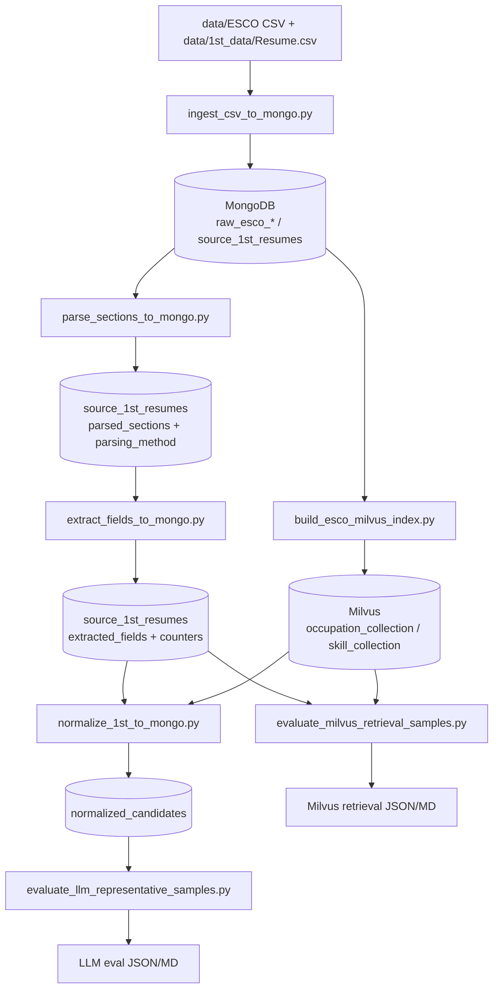

# Issue6+ Script Input/Output Map

## Scope
- Covers scripts introduced/used from Issue #6 onward in `script/pipeline_mongo`.
- Focus: input source, output destination, and main persisted artifacts.

## Pipeline Flow (Issue #6 -> Current)


## Script I/O Table
| Issue | Script | Main Input | Main Output | Persisted Artifacts |
|---|---|---|---|---|
| #6 | `ingest_csv_to_mongo.py` | ESCO CSV files, `Resume.csv` | Mongo collections populated | `raw_esco_occupations`, `raw_esco_skills`, `raw_esco_isco_groups`, `raw_esco_skill_groups`, `raw_esco_broader_relations_occ`, `raw_esco_broader_relations_skill`, `raw_esco_occupation_skill_relations`, `source_1st_resumes` |
| #7/#8 | `parse_sections_to_mongo.py` | `source_1st_resumes.resume_html` / `resume_text` | Section-parsed documents | `source_1st_resumes.parsed_sections`, `parsing_method`, `parser_version`; report: `script/pipeline_mongo/parse_sections_report.json` |
| #9 | `extract_fields_to_mongo.py` | `source_1st_resumes.parsed_sections` (+ html/text) | Deterministic extracted fields | `source_1st_resumes.extracted_fields`, `extraction_method`, `extractor_version`, `experience_count`, `education_count`, `skill_count`; report: `script/pipeline_mongo/extract_fields_report.json` |
| #10 | `normalize_1st_to_mongo.py` | `source_1st_resumes` + `raw_esco_*` + (optional) Milvus embeddings | Normalized candidate records | `normalized_candidates` (upsert by `source_dataset + source_record_id`), includes `occupation_candidates`, `skill_candidates`, `normalization_status`, `llm_handoff`, `matching_debug`; metrics JSON via `--metrics-out` |
| #11/#12 support | `evaluate_llm_representative_samples.py` | `normalized_candidates` sample docs | LLM-as-judge report | `script/pipeline_mongo/llm_eval_10samples*.json`, `docs/reports/llm/LLM-Eval-10samples-20260316-Latest.md` (+ old snapshots in `docs/reports/llm/old/`) |
| Current (Embedding infra) | `build_esco_milvus_index.py` | Mongo ESCO collections (`raw_esco_*`) | Milvus vector collections | `occupation_collection`, `skill_collection` (or env-defined names); summary: `script/pipeline_mongo/milvus_build_report.json` |
| Current (Retrieval validation) | `evaluate_milvus_retrieval_samples.py` | `source_1st_resumes` representative docs + Milvus collections | Top-K retrieval visualization | `script/pipeline_mongo/milvus_retrieval_samples.json`, `docs/reports/retrieval/Milvus-Retrieval-Samples.md` |

## Current Default Collections
- Mongo source:
  - `source_1st_resumes`
- Mongo normalized output:
  - `normalized_candidates`
- Milvus embedding collections (from `.env`):
  - `occupation_collection`
  - `skill_collection`

## Quick Run References
1. ESCO embedding build:
```bash
python .\script\pipeline_mongo\build_esco_milvus_index.py --db-name prodapt_capstone --drop-existing
```

2. Normalization full run:
```bash
python .\script\pipeline_mongo\normalize_1st_to_mongo.py --db-name prodapt_capstone --limit 0 --ranking-profile balanced --threshold-strictness medium --metrics-out .\script\pipeline_mongo\metrics_issue10_full_balanced_medium.json
```

3. Milvus retrieval sample visualization:
```bash
python .\script\pipeline_mongo\evaluate_milvus_retrieval_samples.py --db-name prodapt_capstone --sample-size 10 --top-k 5
```
